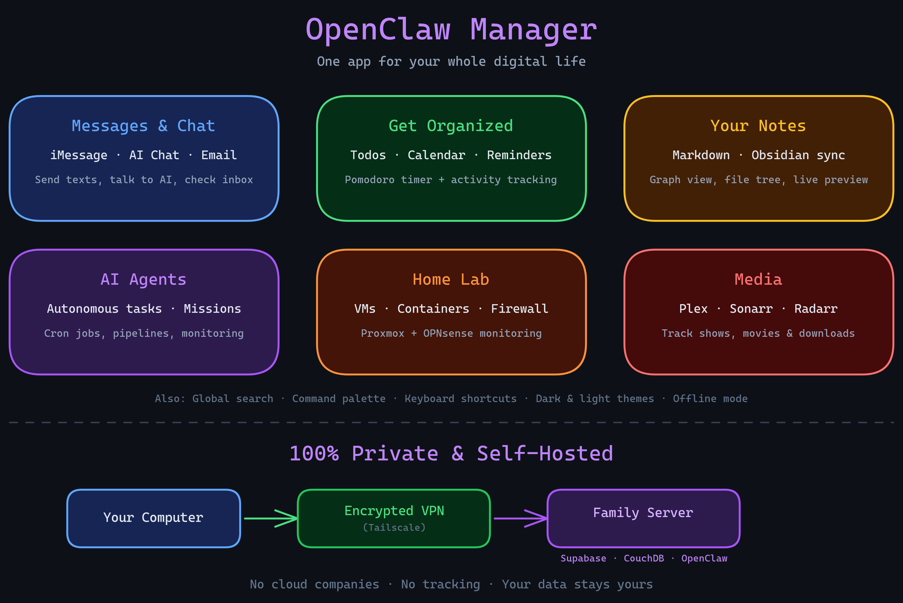

<p align="center">
  
</p>

<h1 align="center">OpenClaw Manager</h1>

<p align="center">
  A self-hosted Tauri desktop app for personal infrastructure, AI workflows, messaging, and operations.
</p>

<p align="center">
  <a href="LICENSE"></a>
  
  
</p>

## Status

This repository is under active product and architecture work.

- `main` is the rollout branch for the current clean release line.
- Riskier feature work is kept in topic branches until it is safe to merge.
- Dashboard widget and edit-mode fixes are intentionally isolated from the rollout branch until they are re-verified.

If you want the current roadmap and branch queue, start with [`.planning/ROADMAP.md`](.planning/ROADMAP.md) and [`.planning/PROJECT.md`](.planning/PROJECT.md).

## What This App Is

OpenClaw Manager is a modular desktop control plane. It combines:

- AI chat and agent operations
- dashboard views for missions, pipelines, and system state
- personal productivity modules like tasks, notes, and calendar
- homelab and service integrations
- local-first desktop delivery through Tauri

OpenClaw is the main backend capability layer. AgentShell, agent secrets, and MemD are the next core architecture lanes on the roadmap.

## Core Modules

| Module | Purpose | Typical dependency |
|---|---|---|
| Messages | BlueBubbles-backed messaging | BlueBubbles |
| AI Chat | Chat UI and model access | OpenClaw or compatible gateway |
| Dashboard | Widgets, missions, pipelines, activity | OpenClaw + Supabase |
| Agents | Agent execution and monitoring | OpenClaw |
| Crons | Scheduled agent and job workflows | OpenClaw |
| Missions | Long-running task tracking | OpenClaw + Supabase |
| Todos / Notes / Calendar / Email | Personal command-center modules | Service-specific integrations |
| Home Lab | Proxmox / OPNsense visibility | Proxmox, OPNsense |
| Media Radar | Media stack status | Plex, Sonarr, Radarr |

## Architecture

<p align="center">
  
</p>

<p align="center">
  
</p>

The app runs as a Tauri v2 desktop shell with:

- a React + Vite frontend in [`frontend/`](frontend/)
- an Axum backend in [`src-tauri/`](src-tauri/)
- local desktop secret storage through the OS keychain
- local persistence plus Supabase-backed sync/integration paths

The frontend talks to the local Axum API. Remote services are reached through the backend, not directly from the browser layer.

## Repository Layout

```text
clawcontrol/
├── frontend/                # React + Vite + TypeScript app
├── src-tauri/               # Tauri v2 shell + Axum backend
├── supabase/                # DB and sync-related assets
├── docs/                    # Architecture, setup, and security docs
├── scripts/                 # Checks, helpers, QA scripts
├── .github/                 # CI, release, PR, and issue templates
└── .planning/               # Roadmap, milestone, and architecture planning
```

## Quick Start

### Clone

```bash
git clone https://github.com/Josue7211/clawcontrol.git
cd clawcontrol
```

### Install

```bash
npm install
cd frontend && npm install && cd ..
```

### Development

```bash
npm run tauri:dev
```

### Production Build

```bash
npm run tauri:build
```

## Requirements

- Node.js 20+
- Rust stable
- Tauri v2 system dependencies for your platform
- Optional: Supabase and external services for full module coverage

Tauri prerequisites:

- https://v2.tauri.app/start/prerequisites/

## Configuration

Most connections can be configured from the app under `Settings > Connections`.

For development, copy the example env file if present and set only what you need. Sensitive values should stay in the OS keychain whenever possible.

### Common variables

| Variable | Purpose |
|---|---|
| `SUPABASE_URL` | Supabase project URL |
| `SUPABASE_ANON_KEY` | Supabase anon key |
| `SUPABASE_SERVICE_ROLE_KEY` | Server-side Supabase key |
| `OPENCLAW_WS` | OpenClaw WebSocket URL |
| `OPENCLAW_API_URL` | OpenClaw HTTP API URL |
| `OPENCLAW_API_KEY` | OpenClaw API key |
| `AGENTSHELL_URL` | AgentShell adapter URL |
| `MC_BIND_HOST` | Bind host for exposing the local API |
| `MC_AGENT_KEY` | Stable API key for external agents |

Additional service variables are documented in the settings UI and service-specific docs under [`docs/`](docs/).

## Security

This app handles private data and service credentials. Current security posture:

- secrets are stored in the OS keychain, not committed env files
- the frontend uses the local backend as the trust boundary
- the repo includes security docs, CI, issue templates, and PR templates for open-source maintenance
- agent secrets work is being hardened as an explicit architecture lane

See [docs/SECURITY.md](docs/SECURITY.md) for the security notes currently tracked in-repo.

## Commands

```bash
# Frontend build
cd frontend && npm run build

# Frontend tests
cd frontend && npm run test

# Frontend type check
cd frontend && npx tsc --noEmit

# Rust check
cd src-tauri && cargo check

# Rust tests
cd src-tauri && cargo test

# Full local gate
./scripts/pre-commit.sh
```

## Contributing

Start with [CONTRIBUTING.md](CONTRIBUTING.md).

Current workflow expectations:

1. Branch from the current stable line.
2. Keep one concern per branch and per PR.
3. Run `./scripts/pre-commit.sh` before opening a PR.
4. Use the PR template in [`.github/pull_request_template.md`](.github/pull_request_template.md).
5. Do not mix roadmap/planning churn with unrelated product fixes unless the change is intentionally docs-only.

## Roadmap

Current roadmap work includes:

- stable rollout branch management
- dashboard/widget edit-mode stabilization in isolated branches
- MemD as the durable memory layer
- AgentShell contract hardening
- agent secrets hardening
- final integration and production verification

See:

- [`.planning/ROADMAP.md`](.planning/ROADMAP.md)
- [`.planning/PROJECT.md`](.planning/PROJECT.md)

## License

[AGPLv3](LICENSE)
