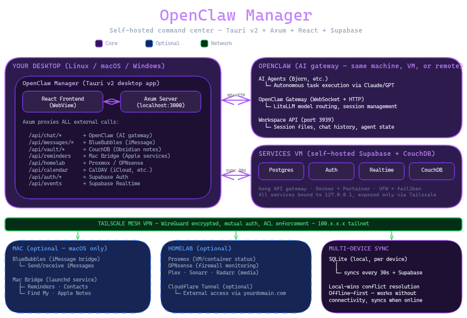

# Security Model

This document describes OpenClaw Manager's security architecture, threat model, and hardening measures. It is intended for contributors, security reviewers, and anyone self-hosting the application.

## Architecture Overview

OpenClaw Manager is a Tauri v2 desktop application with an embedded Axum HTTP server bound to `127.0.0.1:3000`. The frontend is a React SPA rendered in Tauri's WebView. All remote services (BlueBubbles, OpenClaw, Supabase) are accessed over a Tailscale WireGuard mesh VPN. Nothing is exposed to the public internet.



The Axum server acts as the sole gateway between the frontend and all backend services. The frontend never contacts remote services directly.

## Authentication Layers

Four independent authentication layers protect different boundaries:

### Layer 1: MC_API_KEY (local process isolation)

The Axum server only listens on `127.0.0.1:3000`, accepting connections exclusively from the local machine. A 256-bit random hex key (`MC_API_KEY`) is auto-generated on first run and stored in the OS keychain. Every request from the Tauri WebView includes this key in the `X-API-Key` header.

- Constant-time comparison via the `subtle` crate prevents timing attacks.
- WebSocket connections pass the key as a `?apiKey=` query parameter (custom headers are not supported in the WebSocket handshake).
- In debug builds only, requests from `localhost` origins are allowed without the key for developer convenience. This bypass is compiled out in release builds (`#[cfg(debug_assertions)]`).
- If the keychain is unavailable and no key can be generated, the server returns `503 Service Unavailable` for all requests.
- Exempt paths: `/api/health`, `/api/auth/*`, resource endpoints (avatars, attachments, stickers), and CORS preflight (`OPTIONS`).

### Layer 2: Supabase GoTrue JWT (user authentication)

After login, the Axum server holds the user's JWT access token and refresh token in memory (never persisted to disk). The `inject_session` middleware auto-refreshes tokens within 60 seconds of expiry using a serializing mutex to prevent concurrent refresh storms.

- On refresh failure, the session is cleared and the user must re-authenticate.
- Tokens are zeroized on drop (see "Memory Protections" below).

### Layer 3: TOTP MFA (aal2 enforcement)

The `RequireAuth` extractor enforces MFA verification before any data access. If `session.mfa_verified` is `false`, the extractor returns `403 Forbidden`. This is a hard gate: there is no way to access data endpoints without completing TOTP verification.

Auth routes (`/api/auth/*`) are exempt from the API key check and handle their own session validation internally.

### Layer 4: Tailscale ACLs (network-level auth)

All remote services bind to Tailscale IPs (`100.x.x.x`) and are invisible to the public internet. Tailscale provides:

- **Mutual authentication**: every node has a WireGuard identity verified by the coordination server.
- **ACL enforcement**: only authorized tailnet nodes can reach specific services and ports.
- **Encrypted transit**: all traffic is WireGuard-encrypted end-to-end.

On startup, `tailscale.rs` runs `startup_verify()` in a background thread to validate that configured service IPs match their expected Tailscale hostnames. Mismatches are logged as warnings. The `verify_peer()` function checks IP-to-hostname mappings before sending credentials to remote services.

## Secret Management

### Bootstrap secrets (OS keychain)

At startup, `secrets.rs` loads all credentials from the OS keychain (`keyring` crate, service name `com.mission-control`). The keychain stores service URLs, API keys, passwords, and tokens for all integrations (BlueBubbles, OpenClaw, Proxmox, Supabase, etc.).

Secrets are loaded into an in-memory `HashMap<String, String>` wrapped in `Arc<RwLock>` and accessed via `AppState::secret()`. They are never written to process-wide environment variables, so they do not appear in `/proc/PID/environ`.

A `.env.local` file is supported as a dev-mode fallback. Only keys that match the known secret names are loaded, and keychain values always take precedence.

### Runtime secrets (Supabase user_secrets)

After login, the app fetches the user's `user_secrets` rows from Supabase. Each row contains credentials for one service, encrypted with AES-256-GCM.

**Encryption details:**
- **Key derivation**: Argon2id with m_cost=65536 (64 MiB), t_cost=3, p=4, producing a 32-byte key. These parameters follow OWASP recommendations for interactive logins.
- **Per-user salt**: A random 16-byte salt stored in `user_profiles.encryption_salt` (base64-encoded). Never derived from deterministic values like user IDs.
- **Encryption**: AES-256-GCM with a fresh random 12-byte nonce per encryption call. The ciphertext and nonce are stored as base64 strings.
- **Decryption key lifetime**: The encryption key is derived from the user's password at login and held in the `UserSession` struct. It is zeroized when the session is dropped.

If no `user_secrets` exist yet, the app auto-migrates credentials from the OS keychain to Supabase on first login.

### IPC key restrictions

The frontend communicates with the Rust backend via Tauri IPC commands (`get_secret`, `set_secret`). Both commands enforce strict allowlists:

- `FRONTEND_BLOCKED_KEYS`: 26 sensitive keys (service-role-key, API keys, passwords, tokens) that the frontend can never read via IPC.
- `FRONTEND_BLOCKED_WRITE_KEYS`: `mc-api-key`, `supabase.service-role-key`, and `supabase.anon-key` cannot be written from the frontend.

The frontend is only permitted to read: `mc-api-key`, `bluebubbles.host`, `openclaw.api-url`, and `supabase.url`.

## Memory Protections

- **Zeroize on drop**: `UserSession` implements `Drop` to zeroize `access_token`, `refresh_token`, and `encryption_key` using the `zeroize` crate. This prevents secrets from lingering in freed memory.
- **Core dump prevention**: On Unix, `RLIMIT_CORE` is set to zero before any secrets are loaded (`main.rs`, line 23-33). This prevents core dumps from containing sensitive data.
- **No process environment**: Secrets are stored in a private `HashMap`, never in `std::env::set_var`, so they cannot be read from `/proc/PID/environ`.

## Data Protection

### Local SQLite

The local database (`{data_local_dir}/mission-control/local.db`) is configured with:

- `journal_mode=WAL` for concurrent reads.
- `secure_delete=ON` to overwrite deleted data with zeros.
- `foreign_keys=ON` for referential integrity.
- `busy_timeout=5000` to handle concurrent access.
- **File permissions**: `0600` on the database file, `0700` on the containing directory (Unix only).

The `api_cache` table is scoped by `user_id`, preventing cross-user data leakage on shared machines.

### Soft-delete lifecycle

Rows in 16 tables support soft-delete via a `deleted_at` column:

1. **Soft-delete**: Sets `deleted_at` to the current timestamp. Data remains recoverable.
2. **30-day retention**: Soft-deleted rows are retained for 30 days for recovery.
3. **Hard-delete**: After 30 days, a background cleanup job permanently removes soft-deleted rows that have been synced to Supabase (no pending mutations in `_sync_log`).

The cleanup job also purges stale `api_cache` entries (>7 days), synced `_sync_log` entries (>7 days), and old `_conflict_log` entries (>30 days).

### Supabase (PostgreSQL)

- **Row-Level Security (RLS)**: Enabled on all tables. Queries use the user's JWT (`select_as_user`) so RLS policies enforce per-user isolation.
- **Service role key**: Used only by the Axum backend for administrative operations (never exposed to the frontend).

## Network Security

### SSRF Protection

The link preview endpoint (`GET /messages/link-preview`) fetches OpenGraph metadata from user-provided URLs. SSRF is mitigated with three layers:

1. **Hostname blocklist**: Regex-based blocklist covering localhost, loopback (`127.*`), private ranges (`10.*`, `172.16-31.*`, `192.168.*`), link-local (`169.254.*`), null (`0.*`), and IPv6 equivalents (`::1`, `fe80:`, `fc00:`, `fd*`, `::ffff:*`).
2. **DNS resolution check**: After passing the hostname blocklist, the resolved IP addresses are checked against the same private ranges. This prevents DNS rebinding attacks where a public hostname resolves to an internal IP.
3. **Redirect validation**: The HTTP client is configured with `redirect::Policy::none()`. Redirect targets are manually validated against the blocklist before following, preventing redirect-based SSRF bypasses.

### Content Security Policy

Configured in `tauri.conf.json`:

```
default-src 'self';
script-src 'self';
worker-src 'none';
connect-src 'self' http://127.0.0.1:3000 http://localhost:5173
            ws://localhost:5173 ws://127.0.0.1:* http://127.0.0.1:*;
img-src 'self' data: http://127.0.0.1:3000;
style-src 'self' 'unsafe-inline' https://fonts.googleapis.com;
font-src 'self' data: https: https://fonts.gstatic.com;
object-src 'none';
base-uri 'self';
form-action 'self'
```

Key restrictions:
- No `unsafe-eval`: blocks dynamic code execution (`Function()` constructor, string-based `setTimeout`).
- `worker-src 'none'`: blocks Web Workers and Service Workers.
- `object-src 'none'`: blocks Flash, Java, and other plugin content.
- `connect-src` limited to localhost/127.0.0.1 origins only.

### HTML Sanitization (DOMPurify)

All user-generated HTML (Markdown rendering, link previews) passes through DOMPurify with a strict configuration (`lib/sanitize.ts`):

- **Allowed tags**: Basic formatting, links, images, tables, code blocks. No forms, iframes, scripts, or embeds.
- **Allowed attributes**: `href`, `target`, `rel`, `src`, `alt`, `title`, `class`, `id`, dimension attributes, table span attributes.
- `ALLOW_DATA_ATTR: false`: Blocks all `data-*` attributes.
- **Link hardening**: All `<a>` tags get `rel="noopener noreferrer"` and `target="_blank"`.
- **Image source restriction**: `` is restricted to `data:image/*` and `/api/*` paths. All other sources are stripped.

### Response Headers

Applied to all API responses via the `no_store_api_responses` middleware:

- `Cache-Control: no-store, no-cache, must-revalidate` -- prevents WebKitGTK from caching sensitive data to disk.
- `Pragma: no-cache` -- HTTP/1.0 compatibility.
- `X-Content-Type-Options: nosniff` -- prevents MIME type sniffing.
- `Referrer-Policy: no-referrer` -- prevents URL leakage via the Referer header.

### CORS

The CORS layer restricts allowed origins to:

- `http://localhost:*` and `http://127.0.0.1:*`
- `tauri://` and `https://tauri.localhost`

No remote origins are permitted.

### Request Timeout

A 30-second `TimeoutLayer` is applied as the outermost middleware. This mitigates slowloris-style attacks. SSE and WebSocket routes are unaffected because they send initial response headers immediately.

## Rate Limiting

Per-user (or per-IP for unauthenticated requests) rate limiting with 60-second sliding windows:

| Category | Limit | Applies to |
|----------|-------|------------|
| Auth | 30/min | `/api/auth/*` (except `/api/auth/session`) |
| Chat/AI | 10/min | `/api/chat/*` |
| Notifications | 5/min | `/api/notify` |
| Bulk reads | 10/min | GET on `/api/todos`, `/api/missions`, `/api/ideas`, `/api/knowledge`, `/api/captures` |
| General reads | 120/min | All other GET requests |
| Mutations | 30/min | POST, PATCH, DELETE |

Exempt: `/api/auth/session` (polled every 2s during OAuth) and `/api/health`.

### Connection Limits

- **WebSocket**: Max 5 concurrent connections (chat). Enforced via `AtomicUsize` counter with RAII guard (`WsConnectionGuard`).
- **Messages SSE**: Max 5 concurrent connections. Counter incremented on connect, decremented on disconnect.
- **Events SSE**: Max 5 concurrent connections. Same pattern.
- **Pipeline processes**: Max 10 concurrent spawned processes. Counter in `ACTIVE_PIPELINES`.

Exceeding any limit returns `429 Too Many Requests`.

## Input Validation

The `validation.rs` module provides defense against PostgREST injection:

- **`validate_uuid`**: Strict regex for UUID v4 format. Rejects any string containing PostgREST control characters (`&`, `=`, `(`, `)`, `;`).
- **`sanitize_postgrest_value`**: Rejects empty strings, strings over 255 chars, and strings containing injection characters.
- **`sanitize_search_query`**: Percent-encodes PostgREST special characters for safe use in `ilike` patterns.
- **`validate_date`**: Strict `YYYY-MM-DD` format.
- **`validate_enum`**: Validates against an explicit allowlist.

## Log Redaction

The `redact.rs` module strips secrets from log output using pattern matching:

- API keys (`sk-*`, `sk-ant-*`), GitHub tokens (`ghp_*`, `gho_*`), AWS keys (`AKIA*`).
- JWT tokens (`eyJ*`).
- Long hex strings (32+ characters).
- Password/token/secret assignments in config-style text.

Matched secrets are replaced with `first4***last4` format. Short strings are preserved.

Request body logging is truncated to prevent large payloads from filling log files. Log files are rotated daily and capped at 100 MB, with files older than 7 days cleaned up on startup.

## Monitoring

### security_events table

Stored in local SQLite. Events are logged for:

- `login_success` / `login_failed`
- `mfa_verify_success` / `mfa_verify_failed`
- `mfa_enroll` / `mfa_unenroll`
- `password_change`
- `logout`

### Automated alerts

If 5 or more `login_failed` events occur within 15 minutes, an ntfy notification is sent at priority 4 (high) with the subject "Security Alert: Multiple Failed Logins".

### audit_log table

Append-only table in local SQLite. Records mutations on critical resources:

- **Actions**: create, update, delete
- **Resource types**: todos, secrets, sessions, and other data tables
- **Fields**: user_id, action, resource_type, resource_id, details (JSON), created_at

Entries are never updated or deleted. The `GET /api/audit-log` endpoint returns entries filtered by the authenticated user's ID, with optional `resource_type`, `action`, and `limit` parameters.

### Delete audit logging

All route handlers that perform destructive operations log the deletion via `audit::log_audit_or_warn` before executing. This ensures a record exists even if the deletion itself fails partway through.

## OAuth Security

- **PKCE**: OAuth flows use PKCE (`code_verifier` / `code_challenge`) stored in `AppState.pkce_verifier`.
- **Nonce verification**: A random nonce is generated at `GET /auth/nonce` and stored in a `Mutex<Option<String>>`. The OAuth callback must return this nonce as the `state` parameter. This prevents code injection via forged callbacks.
- **Single-use**: The nonce is consumed on verification and cannot be replayed.

## For Contributors

### Rules

1. **Never commit secrets.** No `.env` files, API keys, passwords, tokens, IP addresses, or Tailscale addresses in source code.
2. **Never hardcode credentials or service URLs.** All configuration comes from the OS keychain or user settings.
3. **Never upload files to the internet.** No pastebin, 0x0.st, or file-sharing services. All debugging happens locally.
4. **Use `AppState::secret()`** to read secrets. Never call `std::env::var()` for credentials.
5. **Use `redact()`** before logging any string that might contain secrets.
6. **Use `validate_uuid()` / `sanitize_postgrest_value()`** for all user inputs that go into Supabase queries.
7. **Use `RequireAuth` extractor** on all data endpoints. Never access user data without MFA verification.
8. **Use `<button>` for interactive elements**, never `<div onClick>`. All icon-only buttons need `aria-label`.
9. **No dynamic code execution** -- CSP blocks `unsafe-eval`. Do not use `Function()` constructors or string-based `setTimeout`.

### Pre-commit checks

The `scripts/pre-commit.sh` script scans staged files for:

- `.env` files, credential files, `.pem`/`.key` files, SSH keys
- Hardcoded API keys (`sk-*`, `ghp_*`, `AKIA*`), passwords, and Tailscale IPs (`100.x.x.x`)

### CI Pipeline

GitHub Actions (`.github/workflows/ci.yml`) runs on every push to `master` and every PR:

1. **TypeScript typecheck**: `tsc --noEmit`
2. **Frontend tests**: `vitest run`
3. **Production build**: `vite build`
4. **Node security audit**: `npm audit --audit-level=moderate`
5. **Rust check and test**: `cargo check && cargo test`
6. **Rust security audit**: `cargo audit`

All GitHub Actions are pinned to specific commit SHAs (not mutable tags) to prevent supply chain attacks.

## Threat Model

### What is protected

- **User data**: Todos, missions, ideas, knowledge entries, daily/weekly reviews, habits, captures.
- **Service credentials**: API keys, passwords, and tokens for all integrated services.
- **Message history**: iMessage conversations proxied via BlueBubbles.
- **AI chat history**: Conversations with the OpenClaw AI gateway.

### Trust boundaries

1. **OS keychain**: Bootstrap secrets are as secure as the user's login keychain.
2. **Tailscale network**: Only authorized tailnet members can reach services. Compromise of a Tailscale node compromises access to all services that node is authorized for.
3. **Supabase RLS**: Per-user data isolation depends on RLS policies being correctly configured. The service-role key bypasses RLS and is never exposed to the frontend.
4. **Local machine**: The Axum server binds to `127.0.0.1` only. The `MC_API_KEY` provides defense-in-depth against malicious local processes.

### Assumptions

- The user's machine is trusted (not compromised at the OS level).
- Tailscale nodes are authorized by the tailnet admin.
- The OS keychain is secured by the user's login credentials.
- Supabase is self-hosted on infrastructure the user controls.

### Not in scope

- **Physical access attacks**: If an attacker has physical access to the machine, they can extract keychain secrets, read memory, or bypass all software protections.
- **OS-level compromise**: A rootkit or kernel-level exploit can bypass all application-level security.
- **Tailscale coordination server compromise**: If Tailscale's control plane is compromised, an attacker could authorize rogue nodes onto the tailnet.
- **Supply chain attacks on dependencies**: Mitigated by `cargo audit`, `npm audit`, and pinned GitHub Actions, but not fully eliminated.
- **Side-channel attacks**: Timing attacks on the API key are mitigated with constant-time comparison, but other side channels (cache timing, power analysis) are not addressed.
